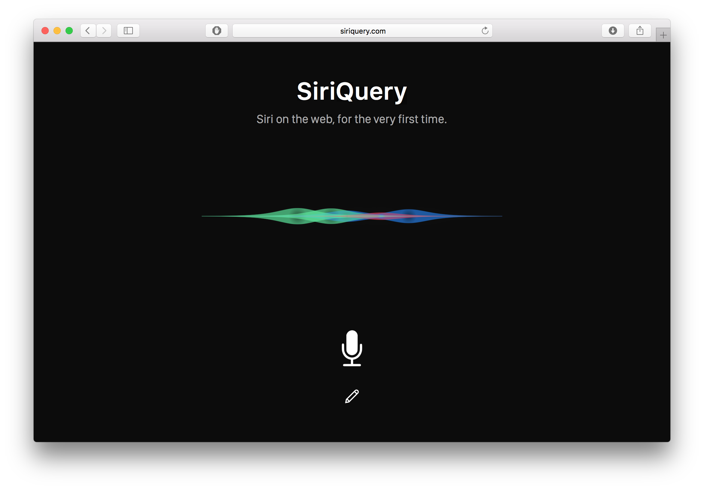

# Siri Query

Siri Query is the first ever cross-platform client for Siri -- it runs on Mac, Windows, and even Android! It records audio through the user's browser and send the recording to a Mac server. The Mac server pipes the audio recording to Siri using a virtual audio input, records Siri's response, and then sends it back to the user.

This project won **2nd place** at HackCU 2017 in Boulder, CO.

**[Watch a video demo](https://www.youtube.com/watch?v=iUnD_9Ejljo)**

  

